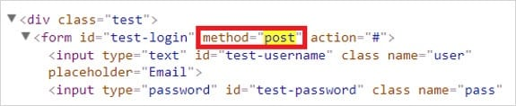

# HTML Injection
> La esencia de este tipo de ataque de inyección es inyectar código HTML a través de las partes vulnerables del sitio web. El usuario malintencionado envía código HTML a través de cualquier campo vulnerable con el propósito de cambiar el diseño del sitio web o cualquier información que se muestre al usuario.
> Como resultado, el usuario puede ver los datos enviados por el usuario malintencionado. Por lo tanto, en general, HTML Injection es solo la inyección de código de lenguaje de marcado al documento de la página.
## Tipos de inyección HTML
Como se mencionó, este ataque de inyección se puede realizar con dos propósitos diferentes:
* Para cambiar la apariencia del sitio web mostrado.
* Robar la identidad de otra persona

Los principales tipos son:
* Stored HTML Injection
* Reflected HTML Injection
## Stored HTML Injection
El ataque de inyección almacenada se produce cuando se guarda un código HTML malicioso en el servidor web y se ejecuta cada vez que el usuario llama a una función adecuada.
## Reflected HTML Injection
Esto se puede dividir nuevamente en más tipos:
* Reflected GET
* Reflected POST
* Reflected URL

El ataque de inyección reflejada se puede realizar de manera diferente según los métodos HTTP, es decir, GET y POST. Me gustaría recordar que con el método POST se están enviando datos y con el método GET se están solicitando datos.

## Referencias 
* [Software Testing Help](https://www.softwaretestinghelp.com/html-injection-tutorial/)
